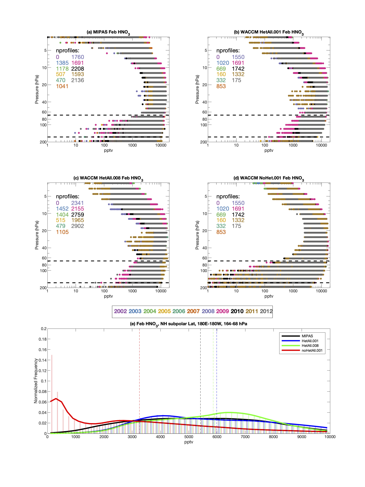
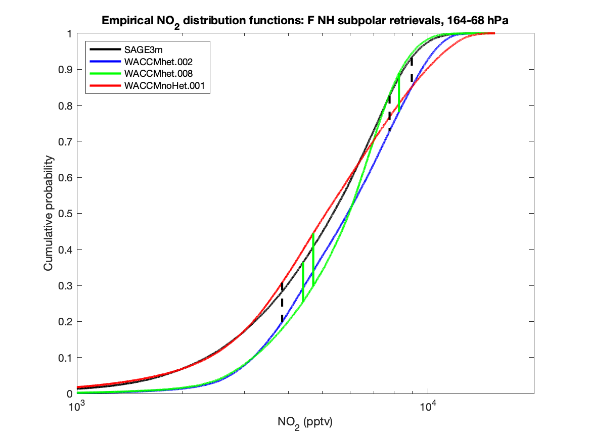

# het_chem
## Some stuff for Doug's het chem project

Here's the Northern Hemisphere (NH) polar vortex for 2002-2003; the vortex edge is the thick black contour. Note that in most of November, the polar vortex is sort of barely there. And by April, too, it is all but gone. So I focused on JFM for the NH subpolar retrievals shown below. 

Here's another example (2004-2005), which is similar if not a little bit more stable.

<!---
The issue I was having is this: if you notice, there are periodically large PV values over the Himalayas. This is similar to what happens over the Andes in the SH, but the Andes run basically N-S, while the Himalayas have a much greater zonal extent. Anyway, all this meant was that I had to tweak the vortex edge definition a bit to make sure we weren't including profiles over the Himalayas in our distributions. Here are the results for that
--->

## HNO3 profiles and PDFs
Here are Jan (excuse the aspect ratio), Feb, and March respectively:

<!---

--->

And here are their CDFs (in all cases, all the CDFs are drawn from different distributions):

To Do:
- [ ] post monsoon plots
- [ ] check out SAGE3m NO2 for the NH

