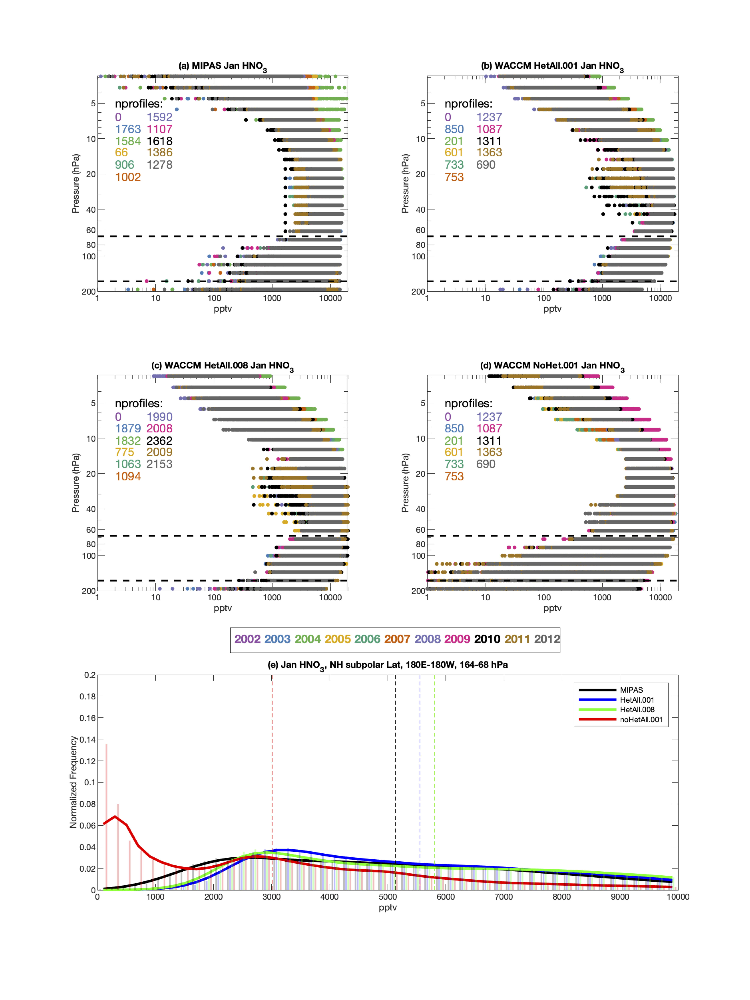
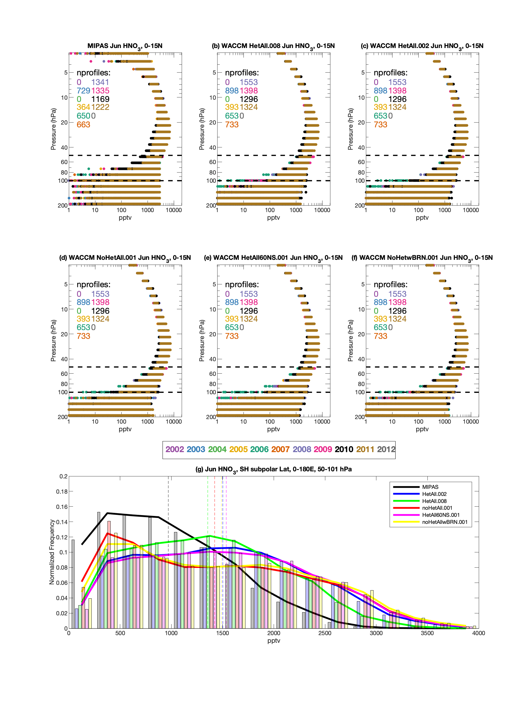
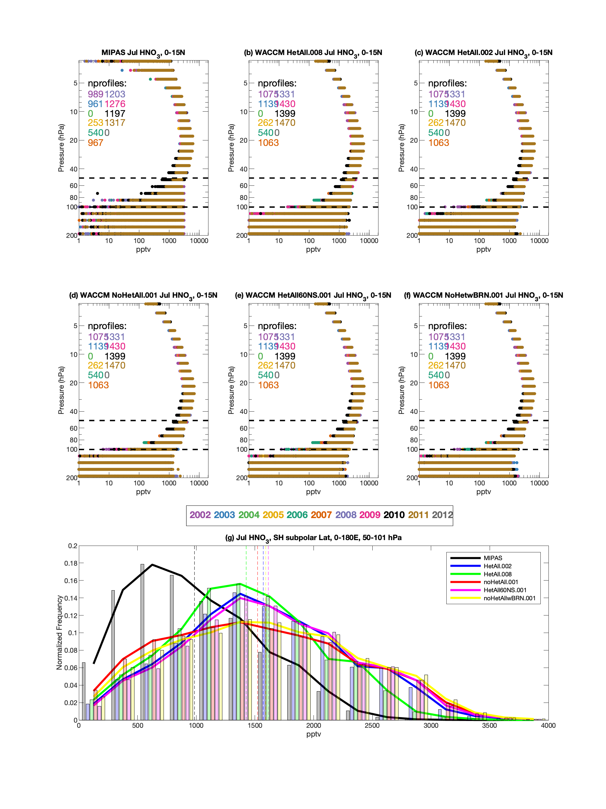

# het_chem
## Some stuff for Doug's het chem project

1. [NH Subpolar](README.md#NH-subpolar)
   * [MIPAS HNO3 PDFs](README.md#MIPAS-HNO3-profiles-and-PDFs)
   * [MIPAS HNO3 CDFs](README.md#HNO3-CDFs)
   * [SAGE3m NO2](README.md#SAGE3m-NO2)
1. [Monsoon HNO3](README.md#Monsoon)

## NH Subpolar

Here's the Northern Hemisphere (NH) polar vortex for 2002-2003; the vortex edge is the thick black contour. Note that in most of November, the polar vortex is sort of barely there. And by April, too, it is all but gone. So I focused on JFM for the NH subpolar retrievals shown below. 

Here's another example (2004-2005), which is similar if not a little bit more stable.

<!---
The issue I was having is this: if you notice, there are periodically large PV values over the Himalayas. This is similar to what happens over the Andes in the SH, but the Andes run basically N-S, while the Himalayas have a much greater zonal extent. Anyway, all this meant was that I had to tweak the vortex edge definition a bit to make sure we weren't including profiles over the Himalayas in our distributions. Here are the results for that
--->

### MIPAS HNO3 profiles and PDFs
Here are Jan (excuse the aspect ratio), Feb, and March respectively:

<!---

--->

Besides the clear indication of heterogeneous processing (compare to noHetChem), I think the most noticeable thing here is the bump in HNO3 in Feb and especially March in WACCMhet008.

### HNO3 CDFs 
In all cases, all the CDFs are drawn from different distributions:

### SAGE3m NO2
As above, but for SAGE3m NO2

If this is right (I think it is, but I will double-check everything), then it looks like everything in the NH is mixing of polar-subpolar air (see noHet60NS vs noHetAll below). I definitely would like to see what this looks like in the deNOy runs.

## Monsoon

Here are the PDF plots for June-September for 0-15N, Eastern Hemisphere only:

To Do:
- [x] post monsoon plots
- [x] check out SAGE3m NO2 for the NH
- [ ] check num profiles for 008 run (sunrise/sunset?)

