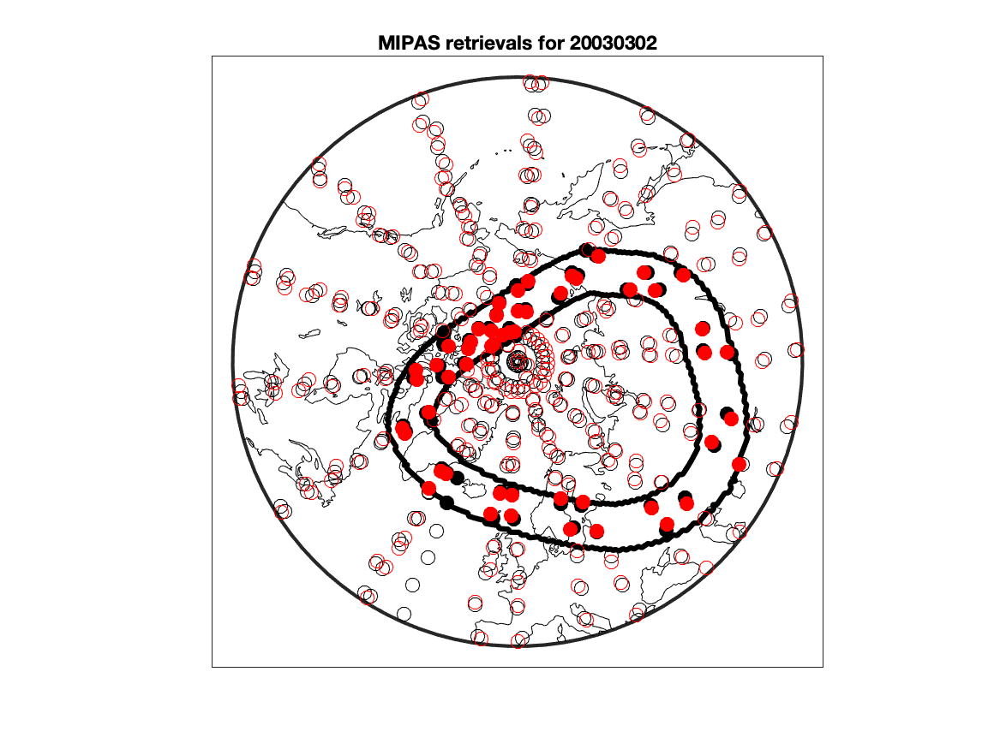
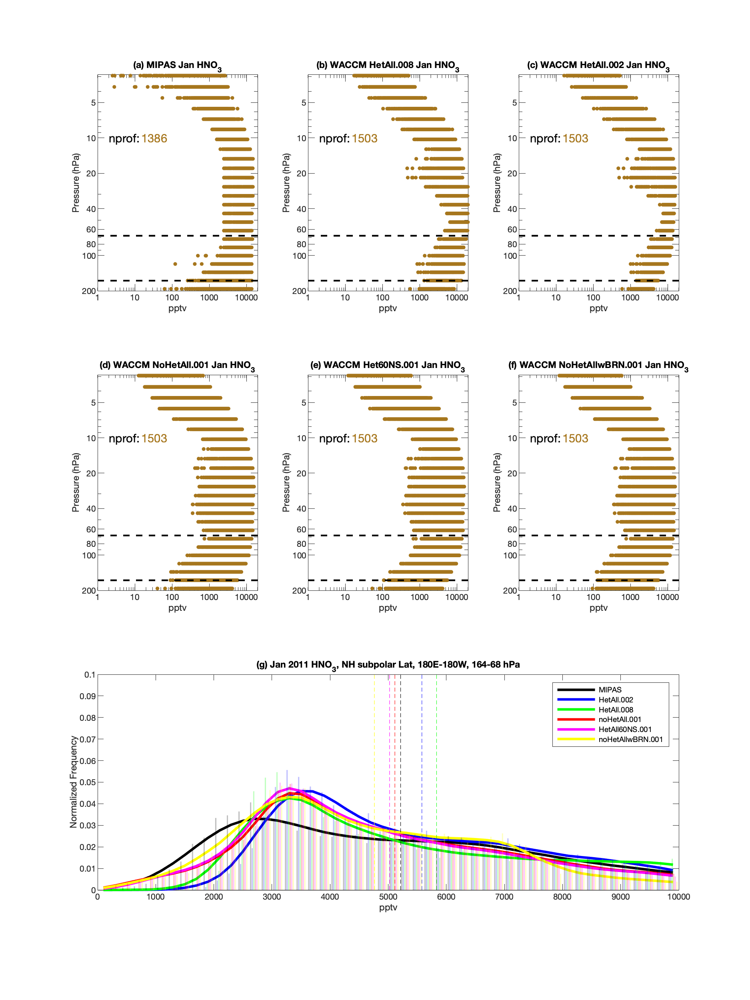

# het_chem
## het chem project update(s)

To do:
- [x] Compare MIPAS and WACCM profiles
- [x] 70-30 hPa
- [x] Plot individual years
- [ ] Apply changes to monsoon
- [ ] Spatial deNOy

1. [NH Subpolar](README.md#NH-subpolar)
   * [Profile discrepancy](README.md#profile-discrepancy)
   * [UTLS (164-68 hPa)](README.md#UTLS-(164-68-hPa))
      * [MIPAS HNO3 PDFs](README.md#UTLS-MIPAS-HNO3-profiles-and-PDFs)
      * [MIPAS HNO3 CDFs](README.md#UTLS-HNO3-CDFs)
   * [70-30 hPa](README.md#70-30-hPa)
      * [MIPAS HNO3 PDFs](README.md#MIPAS-HNO3-profiles-and-PDFs)
      * [MIPAS HNO3 CDFs](README.md#HNO3-CDFs)
   * [Individual years](README.md#individual-years)
1. [Monsoon HNO3](README.md#Monsoon)
<!---   * [SAGE3m NO2](README.md#SAGE3m-NO2) --->

## NH Subpolar

<!---
Here's the Northern Hemisphere (NH) polar vortex for 2002-2003; the vortex edge is the thick black contour. Note that in most of November, the polar vortex is sort of barely there. And by April, too, it is all but gone. So I focused on JFM for the NH subpolar retrievals shown below. 

Here's another example (2004-2005), which is similar if not a little bit more stable.

The issue I was having is this: if you notice, there are periodically large PV values over the Himalayas. This is similar to what happens over the Andes in the SH, but the Andes run basically N-S, while the Himalayas have a much greater zonal extent. Anyway, all this meant was that I had to tweak the vortex edge definition a bit to make sure we weren't including profiles over the Himalayas in our distributions. Here are the results for that
--->

### Profile discrepancy
There are substantially more profiles in WACCM compared to MIPAS. However, good days look, well, good:

Red circles are WACCM, black circles are MIPAS. Pretty good match. But the problem is all the downtime that MIPAS had over its lifetime. The plot below shows the number of NH profiles for each day in WACCM (red), MIPAS (black), and the daily difference (blue):

Essentially, there are many days where MIPAS is observing nothing but WACCM is observing the usual ~500 profiles in the NH. I changed my scripts to only report WACCM profiles on days when MIPAS also has at least 1 profile inside the vortex edge. As you'll see below, this helps but there are still more WACCM profiles than observed. So I may have to set a higher threshold (in the map above there are ~50 profiles...maybe 15 or more is a "good" day? I can look for a "bad" MIPAS day and plot that vs. WACCM), or I can match exact profile numbers.

### UTLS (164-68 hPa)
#### UTLS MIPAS HNO3 profiles and PDFs
Here are Jan (excuse the aspect ratio), Feb, and March respectively:

<!---

--->

#### UTLS HNO3 CDFs 
In all cases, all the CDFs are drawn from different distributions:

### 70-30 hPa
#### MIPAS HNO3 profiles and PDFs
Same as above, but the distribution plots are for 70-30 hPa. After looking at this, I could probably go to ~20 hPa. Anyway, these look really good! You were right Doug, looks like this is where the magic happens.

<!---

--->

#### HNO3 CDFs 

### Individual years
Below are the indiviual years for February. In general, WACCM varies a lot more than the obs.

<!---
### SAGE3m NO2
As above, but for SAGE3m NO2

If this is right (I think it is, but I will double-check everything), then it looks like everything in the NH is mixing of polar-subpolar air (see noHet60NS vs noHetAll below). I definitely would like to see what this looks like in the deNOy runs.

--->

## Monsoon

Here are the PDF plots for June-September for 0-15N, Eastern Hemisphere only:

